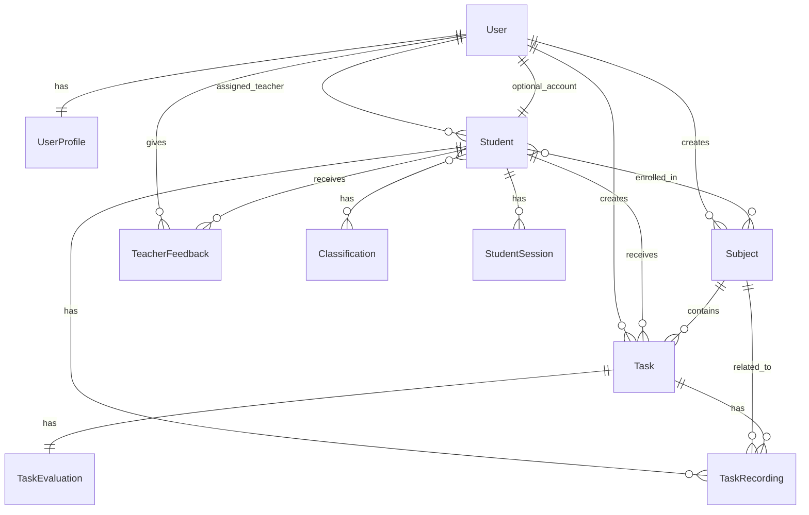
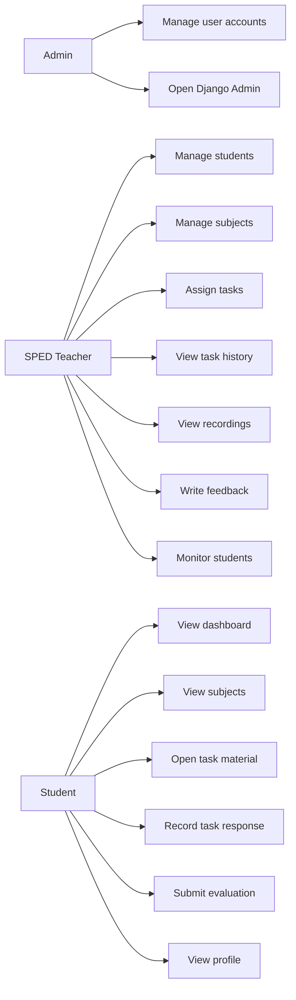
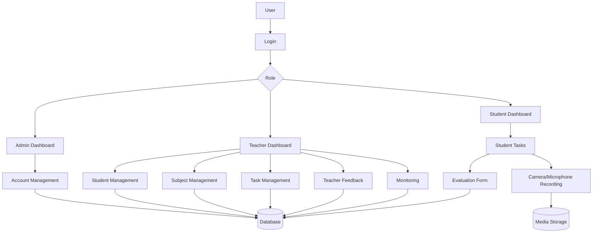

# Complete Project Documentation

## 1. Project Overview

### Project Title
Inclusive Classroom Learning Management System

### Project Description
Inclusive Classroom is a web-based learning management system designed for Special Education (SPED) classroom support. The system helps an administrator, SPED teacher, and students manage learning profiles, subjects, assigned tasks, task recordings, evaluations, feedback, and student monitoring in one platform.

The system is built with Django and uses role-based access so each user only sees features appropriate to their role.

### Purpose / Objectives
- Provide a digital platform for managing SPED student records.
- Allow a SPED teacher to assign tasks with descriptions, deadlines, video links, video files, and attachments.
- Allow students to complete tasks by recording their camera and microphone response.
- Collect required task evaluations after task completion.
- Help the teacher monitor student activity, progress, and task completion.
- Provide teacher feedback records for observations and recommendations.
- Provide an admin panel for managing user accounts.

### Target Users
- System Administrator
- SPED Teacher
- Student

### Scope
The system includes:
- Login and logout
- Role-based dashboards
- Admin account management
- Student profile management
- Subject management
- Student enrollment in subjects
- Task assignment
- Student task completion
- Camera/microphone recording for task evidence
- Required post-task evaluation
- Teacher feedback
- Task history and evaluation review
- Student activity monitoring
- Recording viewing and downloading

### Limitations
- The current development database uses SQLite.
- Uploaded files and recordings are stored in local media storage during development.
- For production deployment on Render, external media storage is recommended because Render's local filesystem is not permanent.
- The student recording captures the student's camera and microphone only. It does not capture YouTube audio to avoid browser permission issues after deployment.
- Internet access is required for externally hosted videos such as YouTube links.

## 4. System Features

### Authentication and Role-Based Access
Users log in with a username and password. After login, the system redirects users based on role:
- Admin goes to the admin dashboard.
- Teacher goes to the teacher dashboard.
- Student goes to the student dashboard.

### Admin Dashboard
The admin dashboard summarizes account-related information and provides access to account management pages.

### Admin Account Management
The administrator can:
- View accounts
- Create accounts
- Edit accounts
- Delete accounts
- Assign roles such as admin, teacher, or student
- Link student accounts to a SPED teacher

### Teacher Dashboard
The teacher dashboard displays classroom statistics such as students, completed tasks, pending tasks, overdue tasks, and recent activity.

### Student Management
The teacher can:
- Add students
- View student details
- Edit student information
- Delete students
- Upload student profile pictures
- Upload birth certificate files
- Record SPED learning information such as learning goals, classification, progress status, and skill progress

### Subject Management
The teacher can:
- Create subjects
- Edit subjects
- Delete subjects
- Set subject icons and colors
- Enroll students in subjects

### Task Assignment
The teacher can assign tasks to students with:
- Title
- Description
- Deadline
- Subject
- Attachment
- YouTube/video link
- Uploaded video file

### Student Task Wall
Students can view assigned tasks, task status, deadlines, subjects, and available materials.

### Student Subject Pages
Students can view tasks grouped by subject. This makes the student interface easier to understand and reduces clutter.

### Task Recording
When a student starts a task, the system records the student's camera and microphone. If the task includes a YouTube video, the video opens in a normal YouTube tab while the app continues recording the student response.

### Task Completion
After recording, the student clicks Done. The system uploads the recording, marks the task as completed, and redirects the student to evaluation.

### Required Task Evaluation
Students must answer all evaluation questions before submitting:
- Enjoyment rating
- Difficulty
- Effort level
- Feeling after the task
- Parent/guardian participation

The system does not allow skipping evaluation questions.

### Task History and Evaluation
The teacher can view:
- All tasks
- Completed tasks
- Pending tasks
- Overdue tasks
- Student evaluations
- Task recordings
- Recording downloads

### Teacher Feedback
The teacher can write observations and recommendations for students.

### Student Monitoring
The system tracks student online status and sessions. It can show whether students are online, recently active, or offline.

### Media Library in Django Admin
The customized Django admin includes access to media files for easier inspection of uploaded files during development.

## 5. Technologies Used

### Programming Languages
- Python
- HTML
- CSS
- JavaScript

### Frameworks and Libraries
- Django
- Bootstrap
- Bootstrap Icons

### Database
- SQLite for development
- Recommended for deployment: PostgreSQL on Render or another managed database

### Tools Used
- Visual Studio Code
- Django Admin
- Web browser
- Git / GitHub, if used for deployment

### Hosting / Deployment Platform
- Recommended platform: Render
- Recommended production media storage: Cloudinary, AWS S3, Supabase Storage, or similar

## 6. System Design

### System Architecture
The system follows a standard Django Model-View-Template architecture.

```text
User Browser
    |
    v
Django URLs
    |
    v
Django Views
    |
    +--> Django Templates
    |
    +--> Django Models
             |
             v
          Database
```

### Main Modules
- Authentication Module
- Admin Account Management Module
- Student Management Module
- Subject Management Module
- Task Management Module
- Task Recording Module
- Evaluation Module
- Teacher Feedback Module
- Monitoring Module

### Database Design / ERD



### Main Database Tables
- User
- UserProfile
- Student
- Classification
- Subject
- Task
- TaskEvaluation
- TaskRecording
- TeacherFeedback
- StudentSession

### Use Case Diagram



### Data Flow Diagram



### Wireframes / Mockups
Suggested wireframes to include in the final printed documentation:
- Login page
- Admin dashboard
- Admin account list
- Create account form
- Teacher dashboard
- Student list
- Student detail page
- Subject list
- Assign task page
- Task history page
- Student dashboard
- Student task wall
- Student subject detail page
- Task evaluation modal
- Task recording detail page

## 7. User Interface

### Screenshots of Every Page
Place screenshots in this section when preparing the final document.

Recommended screenshot list:
- Login Page
- Admin Dashboard
- Account List Page
- Create Account Page
- Edit Account Page
- Teacher Dashboard
- Student List Page
- Add Student Page
- Edit Student Page
- Student Detail Page
- Subject List Page
- Add Subject Page
- Edit Subject Page
- Assign Task Page
- Task History and Evaluation Page
- Task Recording Page
- Teacher Feedback Page
- Student Monitoring Page
- Student Dashboard
- Student Profile Page
- Student Task Wall
- Student Subject List
- Student Subject Detail
- Evaluation Modal

### Description of Each Screen

#### Login Page
Allows users to enter their username and password. The system redirects users based on role.

#### Admin Dashboard
Shows administrative overview and navigation for account management.

#### Account List Page
Displays system accounts and allows the admin to search, filter, edit, or delete accounts.

#### Create Account Page
Allows the admin to create student or teacher accounts and assign required account details.

#### Teacher Dashboard
Shows classroom summaries, recent tasks, and student-related statistics.

#### Student List Page
Displays students managed by the teacher. Includes search and access to student details.

#### Student Detail Page
Shows student profile, classifications, progress, subjects, tasks, and related information.

#### Subject Pages
Allow teachers to manage subjects and allow students to view tasks by subject.

#### Assign Task Page
Allows the teacher to assign tasks with deadlines, files, and video materials.

#### Task History Page
Shows completed, pending, overdue, evaluated, and recorded tasks.

#### Task Recording Page
Allows the teacher to watch or download the student's recorded task response.

#### Teacher Feedback Page
Allows the teacher to write observations and recommendations.

#### Student Monitoring Page
Shows online/offline student activity and session information.

#### Student Dashboard
Shows the student summary, recent tasks, and learning navigation.

#### Student Task Wall
Shows all assigned tasks and lets the student start a task recording.

#### Evaluation Modal
Appears after task completion. All questions are required before submission.

## 8. User Manual

### How to Install / Run the System Locally

1. Install Python.
2. Open the project folder in Visual Studio Code or a terminal.
3. Create a virtual environment:

```bash
python -m venv venv
```

4. Activate the virtual environment.

Windows:

```bash
venv\Scripts\activate
```

5. Install Django and required packages:

```bash
pip install django pillow
```

6. Run migrations:

```bash
python manage.py migrate
```

7. Create a superuser:

```bash
python manage.py createsuperuser
```

8. Start the server:

```bash
python manage.py runserver
```

9. Open the system in the browser:

```text
http://127.0.0.1:8000/login/
```

### Admin Guide

#### Login as Admin
1. Open the login page.
2. Enter admin username and password.
3. Click login.
4. The system opens the admin dashboard.

#### Create an Account
1. Go to Create Account.
2. Enter username, email, and password.
3. Select role.
4. If the account is a student, fill in student details.
5. Click Create Account.

#### Manage Accounts
1. Go to Accounts.
2. Search or filter users.
3. Click Edit to update an account.
4. Click Delete to remove an account.

#### Open Django Admin
1. Click Django Admin in the sidebar.
2. Manage database records if needed.

### SPED Teacher Guide

#### Add a Student
1. Log in as the SPED teacher.
2. Go to Students.
3. Click Add Student.
4. Fill in student information.
5. Upload files if needed.
6. Save the student record.

#### Manage Subjects
1. Go to Subjects.
2. Add a subject with name, icon, color, and description.
3. Enroll students in the subject.

#### Assign a Task
1. Go to Assign Task.
2. Select a student.
3. Select a subject.
4. Enter title, description, and deadline.
5. Add attachment, video URL, or video file if needed.
6. Submit the task.

#### View Task History
1. Go to Task History and Evaluation.
2. Use filters to find tasks.
3. View completed, pending, overdue, and evaluated tasks.
4. Open recordings if available.

#### View Student Recording
1. Open Task History.
2. Click the recording icon.
3. Watch the video.
4. Download the video if needed.
5. Click Close to return.

#### Add Teacher Feedback
1. Go to Teacher Feedback.
2. Select a student.
3. Write observation and recommendation.
4. Submit the feedback.

#### Monitor Students
1. Go to Activity Monitor.
2. View online/offline status and recent session activity.

### Student Guide

#### View Tasks
1. Log in as a student.
2. Go to Task Wall or Subjects.
3. Select the assigned task.

#### Complete a Task
1. Click the main Start Recording button.
2. Allow camera and microphone.
3. If the task has a YouTube video, it opens in a new tab.
4. Watch the video or review the material.
5. Return to the classroom tab.
6. Click Done.
7. Answer all evaluation questions.
8. Submit evaluation.

#### View Profile
1. Go to My Profile.
2. Review student information and learning progress.

## 9. Deployment

### Deployment Platform Used
Recommended: Render

### Live URL / Link
To be added after deployment:

```text
https://your-app-name.onrender.com
```

### Deployment Steps for Render

1. Push the project to GitHub.
2. Create a new Web Service on Render.
3. Connect the GitHub repository.
4. Set the build command, for example:

```bash
pip install -r requirements.txt && python manage.py collectstatic --noinput && python manage.py migrate
```

5. Set the start command, for example:

```bash
gunicorn inclusive_classroom.wsgi:application
```

6. Add required environment variables:

```text
SECRET_KEY=your-secure-secret-key
DEBUG=False
ALLOWED_HOSTS=your-app-name.onrender.com
```

7. Use PostgreSQL for production database if possible.
8. Use external media storage for uploads and recordings.
9. Deploy and test the login, task, recording, evaluation, and download flow.

### Environment Setup Notes
For production, update settings to support:
- Secure secret key from environment variable
- DEBUG=False
- Render host in ALLOWED_HOSTS
- Static file handling
- Persistent database
- Persistent media storage

## 10. Testing

### Test Cases

| Test Case ID | Test Scenario | Steps | Expected Result | Status |
|---|---|---|---|---|
| TC-001 | Login as admin | Enter valid admin credentials | Admin dashboard opens | Passed |
| TC-002 | Login as teacher | Enter valid teacher credentials | Teacher dashboard opens | Passed |
| TC-003 | Login as student | Enter valid student credentials | Student dashboard opens | Passed |
| TC-004 | Invalid login | Enter wrong credentials | Error message appears | Passed |
| TC-005 | Create student account | Admin fills create account form | Student account is created | Passed |
| TC-006 | Add student | Teacher fills student form | Student record is saved | Passed |
| TC-007 | Edit student | Teacher updates student data | Updated data is shown | Passed |
| TC-008 | Add subject | Teacher creates subject | Subject appears in subject list | Passed |
| TC-009 | Enroll student in subject | Teacher enrolls student | Student sees subject | Passed |
| TC-010 | Assign task | Teacher assigns task | Task appears for student | Passed |
| TC-011 | Start recording | Student clicks Start Recording | Camera permission appears and recording starts | Passed |
| TC-012 | Complete task | Student clicks Done | Task is marked completed | Passed |
| TC-013 | Required evaluation | Student tries next without answer | System blocks and asks for answer | Passed |
| TC-014 | Submit evaluation | Student answers all questions | Evaluation is saved | Passed |
| TC-015 | View task history | Teacher opens task history | Task records are displayed | Passed |
| TC-016 | View recording | Teacher opens recording | Video plays | Passed |
| TC-017 | Download recording | Teacher clicks Download Video | Video downloads | Passed |
| TC-018 | Add feedback | Teacher submits feedback | Feedback is saved | Passed |
| TC-019 | Monitor student | Teacher opens monitoring page | Student activity is displayed | Passed |
| TC-020 | Logout | User clicks Sign Out | User returns to login page | Passed |

### Test Results
The system passed the listed functional tests during development. Django system validation was also run using:

```bash
python manage.py check
```

Result:

```text
System check identified no issues.
```

### User Acceptance Testing (UAT)
This section should be signed by the client after testing.

| Item | Description | Accepted |
|---|---|---|
| Login and role access | Users can log in and access correct dashboard | Yes / No |
| Student management | Teacher can manage student records | Yes / No |
| Subject management | Teacher can manage subjects and enrollment | Yes / No |
| Task assignment | Teacher can assign tasks | Yes / No |
| Student recording | Student can record task response | Yes / No |
| Evaluation | Student must answer evaluation questions | Yes / No |
| Task history | Teacher can view task history and recordings | Yes / No |
| Monitoring | Teacher can monitor student activity | Yes / No |

Client Name: ___________________________

Signature: _____________________________

Date: _________________________________

## 11. Conclusion

### Summary
Inclusive Classroom Learning Management System provides a focused platform for SPED classroom support. It allows teachers to manage students, subjects, tasks, evaluations, recordings, feedback, and monitoring through a role-based web application.

### Challenges Faced
- Designing a simple interface suitable for student users.
- Handling camera and microphone permissions in the browser.
- Avoiding unreliable browser screen/audio capture behavior.
- Organizing tasks by subject to reduce confusion.
- Making evaluation required without making the flow difficult for students.
- Preparing the system for deployment where media storage must be persistent.

### Future Improvements / Recommendations
- Add cloud media storage for production.
- Use PostgreSQL for production database.
- Add printable student progress reports.
- Add parent/guardian accounts.
- Add notification reminders for pending and overdue tasks.
- Add charts for student progress over time.
- Add backup and restore tools.
- Add accessibility settings such as font size, contrast mode, and text-to-speech support.

## 12. Appendices

### Client Consent / Approval Letter
Attach signed consent or approval letter here.

### Interview Transcript
Skipped as requested because Section 3 is excluded.

### Gantt Chart
Suggested project phases:

| Phase | Task | Duration |
|---|---|---|
| Phase 1 | Requirement gathering | 1 week |
| Phase 2 | System design | 1 week |
| Phase 3 | Database and backend development | 2 weeks |
| Phase 4 | User interface development | 2 weeks |
| Phase 5 | Testing and debugging | 1 week |
| Phase 6 | Documentation | 1 week |
| Phase 7 | Deployment and final checking | 1 week |

### References
- Django Documentation
- Bootstrap Documentation
- Bootstrap Icons Documentation
- Render Deployment Documentation
- Python Documentation
